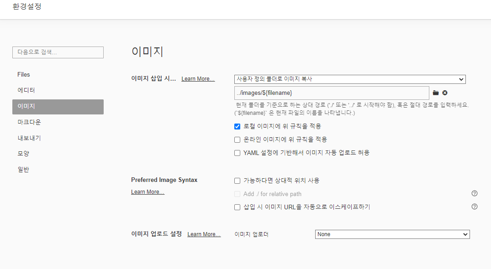

# 깃허브 블로그 이미지 업로드 방법 정리

깃허브 블로그에 이미지를 업로드 하는 방법 중 두 가지를 소개하겠습니다.
  첫 번째는 제가 주로 사용하는 간편한 방법인 Typora를 이용하는 방법이 있고
  두 번째는 VSCode를 이용한 방법이 있습니다.

## 1. Typora로 업로드 하기

먼저, 타이포라를 이용한 방법으로는 우선 타이포라를 다운로드 해 줍니다.
  [타이포라 링크](https://typora.io/) 를 클릭해 타이포라 홈페이지로 가서 아래쪽에 위치한 다운로드를 클릭합니다.
  그리고 타이포라를 설치해서 폴더를 불러온 후, 파일 - 환경설정 으로 들어간 후, 다음과 같이 해줍니다.

이미지 클릭 -> 사용자 정의 폴더로 이미지 복사 선택 -> 경로에 ../images/ 추가를 한 후
  로컬 저장소에서 파일을 끌어다 놓거나, 캡쳐를 복사붙혀넣기 합니다.

그러고 난 후

## 2. VSCode를 이용하여 업로드 하기